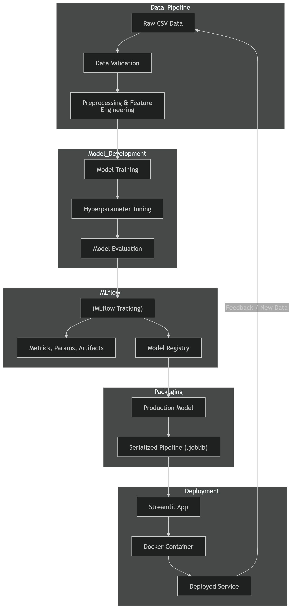

# 🎓 Student Performance Prediction: End-to-End MLOps Pipeline


## 📌 Overview
This project is a complete, production-ready Machine Learning pipeline designed to predict a student's final Math Score based on their demographics, academic background, and test preparation. 

It goes beyond a standard Jupyter Notebook by implementing **MLOps best practices**, including experiment tracking, hyperparameter tuning, Explainable AI (XAI), and containerized web deployment.

## 🏆 Project Highlights
- **Exploratory Data Analysis (EDA):** Comprehensive bivariate/multivariate analysis and data distribution checks.
- **Robust Preprocessing:** Handled categorical encoding and numerical scaling seamlessly using a scikit-learn `ColumnTransformer` Pipeline to prevent data leakage.
- **Advanced Modeling:** Evaluated Linear Regression, Random Forest, and Gradient Boosting. 
- **Model Registry:** Used **MLflow** to track 50+ hyperparameter tuning runs and registered the winning model.
- **Explainable AI (XAI):** Integrated **SHAP** (SHapley Additive exPlanations) to crack open the "black box" and visually explain feature impacts.
- **Production Deployment:** Built an interactive **Streamlit** web application, containerized with **Docker** for universal deployment.

## 📊 Model Performance
The final selected model is a tuned **Gradient Boosting Regressor**, achieving excellent generalization on unseen test data:
* **R² Score:** ~0.87
* **RMSE:** ~5.56
* **MAE:** ~4.29

## 🏗️ MLOps Architecture Diagram



## 📂 Project Structure

```text
student-performance-mlops/
│
├── data/
│   ├── raw/                 # Original student-mat.csv
│   └── processed/           # Scaled and encoded train/test datasets
│
├── notebooks/
│   ├── 01_EDA_and_Preprocessing.ipynb
│   ├── 02_Baseline_Model.ipynb
│   ├── 03_Advanced_Models.ipynb
│   ├── 04_MLflow_Pipeline.ipynb
│   └── 05_Evaluation_SHAP.ipynb
│
├── models/                  # Saved production_pipeline.joblib
├── mlruns/                  # MLflow SQLite database & artifacts
│
├── app.py                   # Streamlit Web Application
├── Dockerfile               # Docker container configuration
├── requirements.txt         # Python dependencies
└── README.md                # Project documentation
```

## 🚀 How to Run Locally

### 1. Clone the repository
```bash
git clone https://github.com/yourusername/student-performance-mlops.git
cd student-performance-mlops
```

### 2. Set up the Virtual Environment
Ensure you have Python installed, then run:
```bash
python -m venv venv
# On Windows:
venv\Scripts\activate
# On Mac/Linux:
source venv/bin/activate
```

### 3. Install Dependencies
```bash
pip install -r requirements.txt
```

### 4. Run the Streamlit Web App
Launch the interactive prediction dashboard:
```bash
streamlit run app.py
```
*The app will automatically open in your browser at `http://localhost:8501`*

### 5. View MLflow Experiments
To explore the training runs, parameters, and metrics:
```bash
mlflow ui --backend-store-uri sqlite:///mlflow.db
```
*Open `http://127.0.0.1:5000` in your browser.*

---

## 🐳 Running with Docker

If you have Docker installed, you can run the entire application in an isolated container without installing Python dependencies on your host machine.

**1. Build the Docker Image:**
```bash
docker build -t student-ml-app .
```

**2. Run the Container:**
```bash
docker run -p 8501:8501 student-ml-app
```
*Access the app at `http://localhost:8501`*

---
